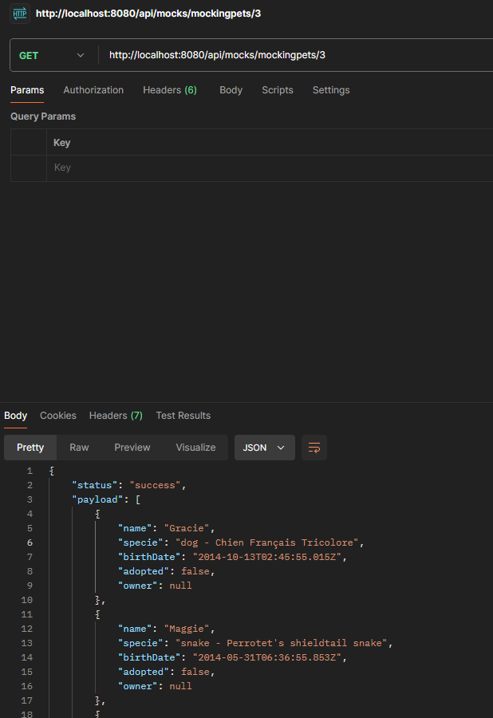
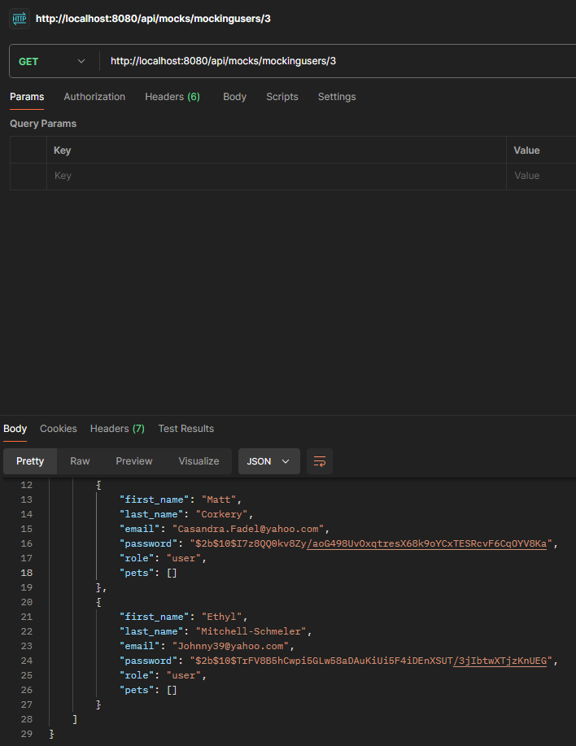
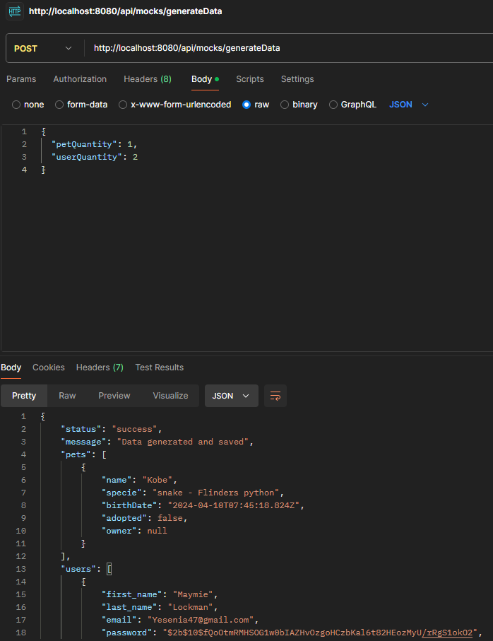

# AdoptMe - Proyecto Final

Este proyecto es la programación del backend para la aplicación de adopción de mascotas "AdoptMe". Fue realizado como parte del curso **Programación Backend III: Testing y Escalabilidad Backend** de **CODERHOUSE**, comisión 70070, con el profesor Omar Jesús Maniás. La aplicación original ha sido ampliada para incluir funcionalidad de generación de datos ficticios de mascotas y usuarios, testeo y documentación de las rutas API y dockerización de la aplicación.

Se puede encontrar el código original en [este repositorio](https://github.com/CoderContenidos/RecursosBackend-Adoptme) y el código actualizado en el nuevo repositorio: [AdoptMe1](https://github.com/scerminati/AdoptMe1).

## Tabla de Contenidos

1. [Descripción](#descripción)
2. [Instalación](#instalación)
3. [Rutas](#rutas)
4. [Controladores](#controladores)
5. [Funcionalidad de `utils`](#funcionalidad-de-utils)
6. [Estructura del Proyecto](#estructura-del-proyecto)
7. [Recursos Utilizados](#recursos-utilizados)
8. [Pruebas de la API](#pruebas-de-la-api)

## Descripción

## Descripción del Proyecto

Este proyecto es una implementación del backend para la aplicación "AdoptMe", diseñada para la adopción de mascotas. El objetivo principal del proyecto es ofrecer una API que permita generar datos de usuarios, mascotas y permitir el registro de adopciones para llevar a cabo un rastreo limpio de los datos en la base de datos.

### Funcionalidades Añadidas

- **Generación de datos ficticios**: Permite crear usuarios y mascotas de prueba para facilitar el desarrollo y las pruebas.
- **Endpoints de la API**: Facilitan la creación y almacenamiento de datos de prueba, así como el registro de adopciones de mascotas.
- **Pruebas y documentación**: Incluye pruebas unitarias y de integración para validar los endpoints y sus respuestas, garantizando el correcto funcionamiento del sistema.

## Instalación

1. Clonar el repositorio:

```bash
   git clone https://github.com/scerminati/AdoptMe1
```

2. Instalar las dependencias:

```bash
   npm install
```

3. Crear un archivo `.env.dev`, `.env.test` o `.env.prod` según la necesidad de uso. En `.env.dev` se permitirá el rastro de cambios en los archivos, en `.env.test` se realizarán las pruebas de las API, ejecutando una aplicación mocha, y en `.env.prod` simplemente se ejecutará la aplicación. Las tres configuraciones tienen distintas variables de entorno asociadas a distintos puertos y distintas base de datos para mantener orden y claridad a la hora de ejecutar. Por defecto, se utilizará el archivo `.env.dev` si no se encuentra el requerido.

4. Iniciar el servidor, dependiendo de la utilidad:

- Para producción

```bash
   npm start
```

- Para development

```bash
   npm run dev
```

- Para testeo

```bash
   npm test
```

## Rutas

### Generación de Datos de Prueba

- `GET /mockingpets/:q`: Genera una cantidad específica de mascotas de prueba.

  - **Parámetro**: `q` - La cantidad de mascotas a generar (por defecto es 50).

- `GET /mockingusers/:q`: Genera una cantidad específica de usuarios de prueba.

  - **Parámetro**: `q` - La cantidad de usuarios a generar (por defecto es 50).

- `POST /generateData`: Genera y guarda en la base de datos una cantidad específica de mascotas y/o usuarios.

  - **Cuerpo de la solicitud**:
    ```json
    {
      "petQuantity": 50,
      "userQuantity": 50
    }
    ```

- `POST /generateAdoptiobns/:q`: Genera una catidad especifica de adopciones sobre mascotas que no estén adoptadas a usuarios aleatoreos.

  - **Parámetro**: `q` - La cantidad de usuarios a generar (por defecto es 50).

## Controladores

- `generatePets`: Genera una cantidad específica de mascotas de prueba usando la función `mockPets`.
- `generateUsers`: Genera una cantidad específica de usuarios de prueba usando la función `mockUsers`.
- `generateData`: Genera y guarda una cantidad específica de mascotas y usuarios de prueba en la base de datos, según los valores proporcionados en el cuerpo de la solicitud.
- `generateAdoptions`: Genera y guarda una cantidad específica de adopciones y usuarios de prueba siempre y cuando existan mascotas y usuarios en la base de datos. Se recomienda realizar una generación de datos previo a realizar la generación de adopciones.

## Funcionalidad de `utils`

La carpeta `utils` contiene funciones que permiten generar datos ficticios de mascotas y usuarios. Estas funciones se apoyan en la librería `@faker-js/faker` para generar aleatoriamente atributos como nombres, especies y características de las mascotas, así como información básica de los usuarios (nombre, apellido, correo electrónico y rol).

- **`mockPets`**: Esta función genera un conjunto de datos ficticios para una mascota, eligiendo aleatoriamente una especie y generando un nombre y una fecha de nacimiento. Además, asigna una mascota como no adoptada y sin dueño.
- **`mockUsers`**: Genera datos ficticios de usuarios, como nombre, apellido, correo electrónico y un rol asignado aleatoriamente (administrador o usuario). También se incluye una contraseña predeterminada, que es cifrada para asegurar la privacidad.

Ambas funciones están diseñadas para facilitar la creación de datos de prueba en la base de datos de la aplicación.

## Documentación de APIs

Este proyecto cuenta con una documentación interactiva para la API utilizando [Swagger](https://swagger.io/). Esto permite explorar y probar los diferentes endpoints disponibles directamente desde un navegador.

### Configuración de Swagger

La configuración para Swagger se encuentra definida en el archivo correspondiente de la API. El esquema cubre las siguientes entidades principales:

- **Usuarios (`users`)**: Gestión de usuarios (registro, obtención, actualización, y eliminación).
- **Mascotas (`pets`)**: Gestión de mascotas (creación, obtención, edición, y eliminación).
- **Adopciones (`adoptions`)**: Gestión de adopciones (creación y consulta).

### Acceso a la documentación

Se puede acceder a la documentación interactiva de Swagger desde la siguiente URL (reemplazando por el puerto configurado en las variables de entorno):

```bash
http://localhost:8080/api-docs
```

## Estructura del Proyecto

El proyecto está organizado en las siguientes carpetas y archivos:

```bash
adoptme1/                           # Carpeta principal del proyecto
├── src/                              # Carpeta principal del código fuente
│   ├── controllers/                  # Controladores que gestionan la lógica de negocio
│   │   ├── adoptions.controller.js   # Controlador para la gestión de adopciones
│   │   ├── *mocks.controller.js*     # Controlador para la generación de datos ficticios
│   │   ├── pets.controller.js        # Controlador para la gestión de mascotas
│   │   ├── sessions.controller.js    # Controlador para la gestión de sesiones de usuario
│   │   └── users.controller.js       # Controlador para la gestión de usuarios
│   ├── dao/                          # Data Access Objects (DAO) que interactúan con la base de datos
│   │   ├── models/                   # Modelos de datos
│   │   │   ├── Adoption.js           # Modelo de adopción
│   │   │   ├── Pet.js                # Modelo de mascota
│   │   │   └── User.js               # Modelo de usuario
│   │   ├── Adoption.js               # Lógica de acceso a datos para adopciones
│   │   ├── Pets.dao.js               # Lógica de acceso a datos para mascotas
│   │   └── Users.dao.js              # Lógica de acceso a datos para usuarios
│   ├── dto/                          # Data Transfer Objects (DTO) para la transferencia de datos
│   │   ├── Pet.dto.js                # DTO de mascota
│   │   └── User.dto.js               # DTO de usuario
│   ├── public/                       # Archivos públicos accesibles
│   │   ├── img/                      # Carpeta de imágenes
│   │   └── *readme/*                 # Carpeta de imágenes de README
│   ├── repository/                   # Repositorios que manejan la persistencia de datos
│   │   ├── AdoptionRepository.js     # Repositorio para adopciones
│   │   ├── GenericRepository.js      # Repositorio genérico para operaciones comunes
│   │   ├── PetRepository.js          # Repositorio para mascotas
│   │   └── UserRepository.js         # Repositorio para usuarios
│   ├── routes/                       # Rutas de la API
│   │   ├── adoption.router.js        # Rutas para adopciones
│   │   ├── *mocks.router.js*         # Rutas para la generación de datos ficticios
│   │   ├── pets.router.js            # Rutas para mascotas
│   │   ├── sessions.router.js        # Rutas para la gestión de sesiones
│   │   └── users.router.js           # Rutas para usuarios
│   ├── services/                     # Lógica de negocio separada en servicios
│   │   └── index.js                  # Servicio principal de la aplicación
│   ├── *test/*                       # Pruebas de la aplicación
│   │   ├── *adoption.test.js*        # Pruebas para adopciones
│   │   ├── *pets.test.js*            # Pruebas para mascotas
│   │   └── *users.test.js*           # Pruebas para usuarios
│   ├── utils/                        # Utilidades generales
│   │   ├── *docSwagger.js*           # Archivo de configuración de Swagger
│   │   ├── index.js                  # Funciones utilitarias generales
│   │   ├── *mocks.js*                # Funciones para generar datos ficticios
│   │   ├── *swagger.js*              # Swagger para la documentación de la API
│   │   └── uploader.js               # Funciones para manejar la carga de archivos
│   └── *app.js*                      # Archivo principal de la aplicación, donde se configura el servidor
├── package-lock.json                 # Archivo de bloqueo de dependencias
├── package.json                      # Archivo de configuración de dependencias y scripts
└── README.md                         # Documentación del proyecto
```

Esta es la estructura principal de los archivos de la aplicación, organizada en diversas carpetas para controlar el acceso a los datos, las rutas, los servicios y los controladores.

- **controllers**: Contiene la lógica de negocio de los controladores (`mocks.controller.js`) que gestionan la generación de datos de prueba.
- **routes**: Define las rutas de la API, incluyendo las nuevas rutas para generar usuarios y mascotas (`mocks.router.js`).
- **services**: Contiene la lógica de acceso a datos y las operaciones de la base de datos para usuarios y mascotas.
- **utils**: Contiene funciones de utilidad, incluyendo las funciones `mockPets` y `mockUsers` para generar datos ficticios, así como también la documentación de las APIs en Swagger.

## Recursos Utilizados

En este proyecto se utilizaron las siguientes dependencias y herramientas:

### Dependencias

- **bcrypt**: Librería para el hashing de contraseñas.
- **cookie-parser**: Middleware para el manejo de cookies en las solicitudes.
- **dotenv**: Carga de variables de entorno desde un archivo `.env`.
- **express**: Framework para la creación de aplicaciones web en Node.js.
- **jsonwebtoken**: Manejo de JSON Web Tokens (JWT) para la autenticación.
- **mongoose**: ODM (Object Data Modeling) para MongoDB y Node.js.
- **multer**: Middleware para la carga de archivos (en este caso, imágenes).
- **swagger-jsdoc**: Herramienta para generar la documentación de la API en formato Swagger.
- **swagger-ui-express**: Middleware para servir la documentación generada por Swagger.

### Dependencias de Desarrollo

- **@faker-js/faker**: Generación de datos falsos para pruebas y desarrollo.
- **chai**: Librería para la aserción en las pruebas.
- **commitizen**: Herramienta para la creación de mensajes de commit con un formato estándar.
- **cross-env**: Permite establecer variables de entorno de manera multiplataforma.
- **mocha**: Framework de pruebas para JavaScript.
- **supertest**: Librería para realizar pruebas HTTP en la API.

## Configuración de Proyecto

El proyecto usa los siguientes scripts para la ejecución de la aplicación:

```json
{
  "scripts": {
    "start": "cross-env NODE_ENV=prod node src/app.js",
    "dev": "cross-env NODE_ENV=dev node --watch src/app.js",
    "test": "cross-env NODE_ENV=test mocha 'src/test/*.test.js' --timeout 5000 --exit"
  }
}
```

## Pruebas de la API

En esta sección se muestran los tests de los diferentes endpoints implementados en la API. Cada test incluye un ejemplo de la solicitud y la respuesta, así como capturas de pantalla de la ejecución en **Postman** o **cURL**.

### 1. Generación de Mascotas

#### Descripción:

Este endpoint permite generar una cantidad específica de mascotas de prueba. Puedes utilizar este endpoint para obtener una lista de mascotas aleatorias para pruebas en el sistema.

#### Endpoint:

`GET api/mocks/mockingpets/:q`

**Parámetro:**

- `q`: Número de mascotas a generar. Por defecto, se generan 50 si el parámetro no está especificado.

#### Ejemplo de Solicitud:

```bash
GET http://localhost:8080/api/mocks/mockingpets/3
```

#### Ejemplo de Respuesta:

```json
[
  {
    "name": "Gracie",
    "specie": "dog - Chien Français Tricolore",
    "birthDate": "2014-10-13T02:45:55.015Z",
    "adopted": false,
    "owner": null
  },
  {
    "name": "Maggie",
    "specie": "snake - Perrotet's shieldtail snake",
    "birthDate": "2014-05-31T06:36:55.853Z",
    "adopted": false,
    "owner": null
  },
  {
    "name": "Bella",
    "specie": "rabbit - Mini Lop",
    "birthDate": "2011-08-15T08:44:48.389Z",
    "adopted": false,
    "owner": null
  }
]
```

#### Captura de Test:



---

### 2. Generación de Usuarios

#### Descripción:

Este endpoint permite generar una cantidad específica de usuarios de prueba. Puedes utilizar este endpoint para obtener usuarios con datos aleatorios para pruebas en el sistema.

#### Endpoint:

`GET /api/mocks/mockingusers/:q`

**Parámetro:**

- `q`: Número de usuarios a generar. Por defecto, se generan 50 si el parámetro no está especificado.

#### Ejemplo de Solicitud:

```bash
GET http://localhost:8080/api/mocks/mockingusers/3
```

#### Ejemplo de Respuesta:

```json
[
  {
    "first_name": "Darrel",
    "last_name": "Beahan",
    "email": "Maribel62@yahoo.com",
    "password": "$2b$10$Q5hhx/7q/.uKMuseI9BFT..iKpKxspy9PkacWoRX5urnro7ji.iEm",
    "role": "user",
    "pets": []
  },
  {
    "first_name": "Matt",
    "last_name": "Corkery",
    "email": "Casandra.Fadel@yahoo.com",
    "password": "$2b$10$I7z8QQ0kv8Zy/aoG498UvOxqtresX68k9oYCxTESRcvF6CqOYV8Ka",
    "role": "user",
    "pets": []
  },
  {
    "first_name": "Ethyl",
    "last_name": "Mitchell-Schmeler",
    "email": "Johnny39@yahoo.com",
    "password": "$2b$10$TrFV8B5hCwpi5GLw58aDAuKiUi5F4iDEnXSUT/3jIbtwXTjzKnUEG",
    "role": "user",
    "pets": []
  }
]
```

#### Captura de Test:



---

### 3. Generación Masiva de Mascotas y Usuarios

#### Descripción:

Este endpoint permite generar tanto mascotas como usuarios de manera masiva en una sola solicitud. Es útil cuando se necesitan grandes cantidades de datos para pruebas o para simular cargas.

#### Endpoint:

`POST api/mocks/generateData`

#### Ejemplo de Solicitud:

```bash
GET http://localhost:8080/api/mocks/generateData
```

**Cuerpo de la Solicitud:**

```json
{
  "petQuantity": 1,
  "userQuantity": 2
}
```

#### Ejemplo de Respuesta:

```json
"pets": [
        {
            "name": "Kobe",
            "specie": "snake - Flinders python",
            "birthDate": "2024-04-10T07:45:18.824Z",
            "adopted": false,
            "owner": null
        }
    ],
    "users": [
        {
            "first_name": "Maymie",
            "last_name": "Lockman",
            "email": "Yesenia47@gmail.com",
            "password": "$2b$10$fQoOtmRMHSOG1w0bIAZHvOzgoHCzbKal6t82HEozMyU/rRgS1okO2",
            "role": "admin",
            "pets": []
        },
        {
            "first_name": "Joanie",
            "last_name": "Crooks",
            "email": "Nick.Feeney92@yahoo.com",
            "password": "$2b$10$UmFuC1XgC3m26ASrrqVYfekMfhfXpa8ERSBUjH5wLTS0xZGU3ZR.q",
            "role": "user",
            "pets": []
        }
    ]
```

#### Captura de Test:



---

### Conclusión

Cada uno de estos endpoints facilita la generación de datos de prueba para mascotas y usuarios. Las capturas mostradas anteriormente validan el funcionamiento correcto de cada uno de ellos, asegurando que las respuestas sean las esperadas en situaciones de pruebas.
